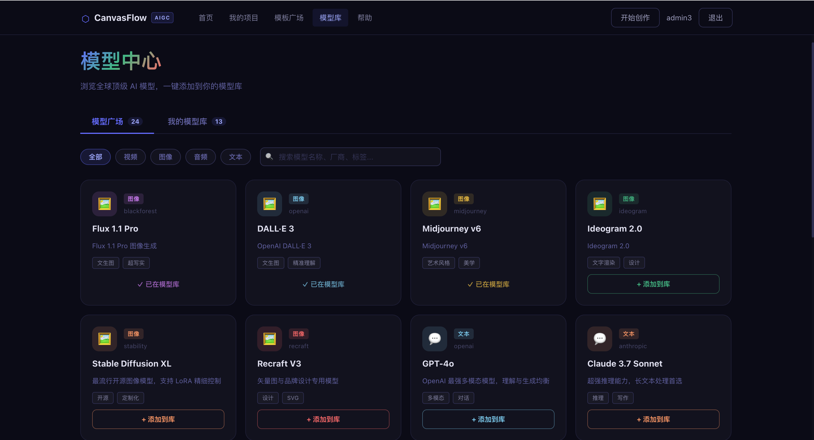
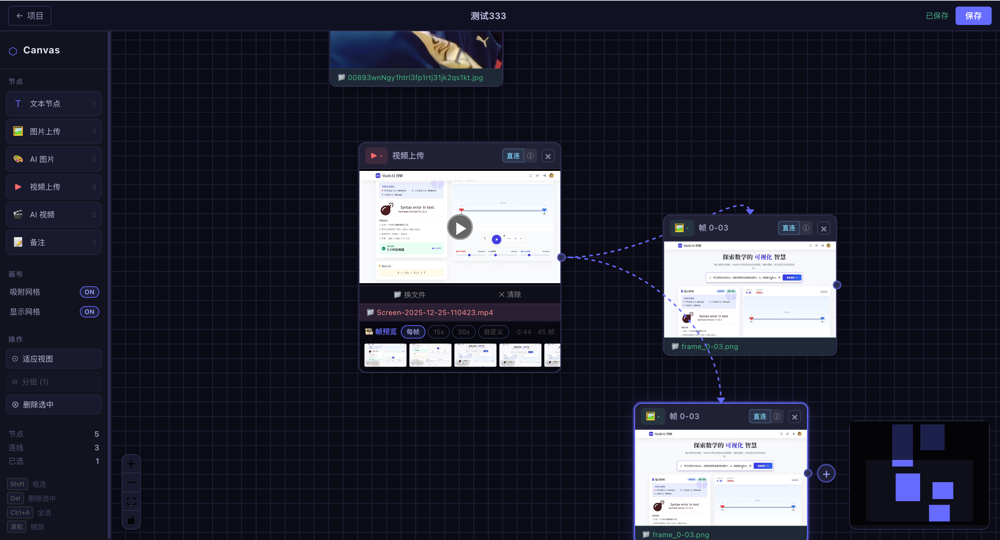
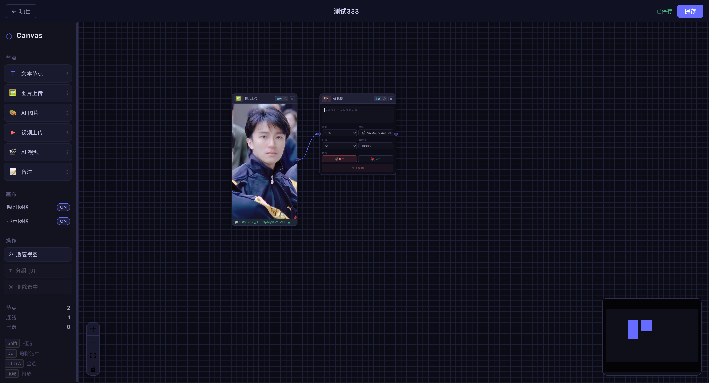
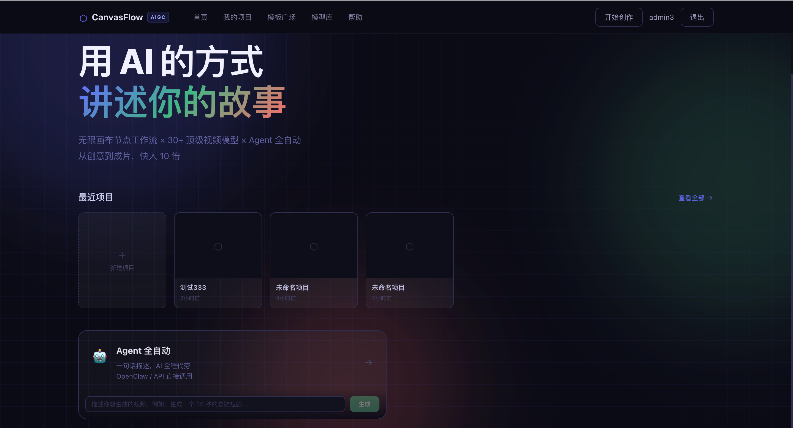

# AIGCCanvasFlow

基于 Vue 3 + VueFlow 的 AIGC 无限画布编辑器。

## 技术栈

### 前端（h5）
- **Vue 3.5** + **Vite 5** + **Pinia 3** + **Vue Router**
- **@vue-flow/core 1.48** — 画布引擎
- **@vue-flow/node-resizer** — 节点尺寸调整
- **video.js** — 视频播放器
- **@ffmpeg/ffmpeg + @ffmpeg/util** — 前端视频处理（转码/拼接，懒加载 WASM）

### 后端（admin）
- **Spring Boot 3** + **Spring Cloud Gateway**
- **MyBatis-Plus** — ORM
- **JWT** — 鉴权
- **微服务模块**：aigc-auth / aigc-canvas / aigc-user / aigc-notify / aigc-gateway

## 已实现功能

### 画布

- 无限画布：平移、缩放、网格背景（线条 + 点阵双层）
- 地图式手势操作：单指/鼠标拖拽平移，双指捏合缩放，触控板双指滑动平移
- 框选节点：Shift + 拖拽
- 吸附网格：可配置网格大小
- 快捷键：`F` 居中视图 / `Ctrl+A` 全选 / `Delete` 删除选中
- 右键菜单：节点、边、空白区域各自的上下文操作
- 从工具栏拖拽节点到画布
- MiniMap 小地图

### 节点类型

| 节点 | 功能 |
|------|------|
| **文本节点** | 双击编辑，内容通过边传播到下游节点 |
| **图片节点** | 本地上传（JPG/PNG/GIF/WebP），hover 显示换图按钮 |
| **视频节点** | 本地上传（MP4/WebM/OGG/MOV），video.js 播放器 |
| **备注节点** | 便利贴样式，可自定义颜色 |
| **分组节点** | 可调整大小的容器，支持子节点跟随移动 |

### 视频帧预览

- 上传视频后自动解析，在播放器下方展示帧条带
- 间隔可选：每帧（1s）/ 15s / 30s / 自定义（最小 0.5s）
- 条带支持左右滑动，hover 帧显示时间戳
- 点击帧缩略图直接跳转播放器到对应时间点
- 每帧下方"**+图**"按钮：以视频原始分辨率重新截取该帧（PNG 无损），生成独立图片节点并自动连边

### 数据流

- 节点间连边，边自动显示上游节点的输出值（最多 30 字符）
- 视频帧生成的图片节点自动与源视频节点连边

### 节点通用操作

- 拖拽移动，调整位置
- 右键菜单：删除、复制节点
- NodeHeader 支持节点类型切换
- 选中高亮，Delete 键删除
- 多选后一键分组 / 解组

### 用户认证

- 登录 / 注册页面（深色主题，Tab 切换）
- 注册后自动登录，JWT token 存储于 localStorage
- 路由守卫：`/projects`、`/canvas` 等需鉴权路由未登录时跳转 `/login`
- 请求拦截器自动附加 `Authorization: Bearer {token}` + `X-User-Id`
- 401 响应自动跳转登录页
- 首页展示已登录用户名 + 退出按钮

### 模型中心

- **广场**：展示平台内置模型列表，骨架屏加载效果，支持按分类/标签浏览
- **我的模型库**（需登录）：
  - 从广场一键添加模型到个人库
  - 手动新增自定义模型（填写名称、API Key、Base URL 等）
  - 编辑 / 启用禁用 / 删除个人模型
- 后端接口：
  - `GET /canvas/models` — 模型广场列表（公开）
  - `GET /canvas/models/library` — 个人模型库
  - `POST /canvas/models/library` — 从广场添加到库
  - `POST /canvas/models/library/custom` — 新增自定义模型
  - `PUT /canvas/models/library/{id}` — 更新自定义模型
  - `PATCH /canvas/models/library/{id}/toggle` — 切换启用状态
  - `DELETE /canvas/models/library/{id}` — 移出模型库

## 目录结构

```
AIGCCanvasFlow/
├── h5/                              # 前端主应用
│   ├── src/
│   │   ├── api/
│   │   │   ├── request.js           # Axios 封装，JWT 拦截、401 处理
│   │   │   ├── authApi.js           # 登录 / 注册 / 登出
│   │   │   ├── modelApi.js          # 模型广场 + 模型库接口
│   │   │   └── aiApi.js             # AI 生成接口
│   │   ├── components/
│   │   │   ├── FlowCanvas.vue       # 画布主组件
│   │   │   ├── Toolbar.vue          # 左侧工具栏
│   │   │   ├── ContextMenu.vue      # 右键菜单
│   │   │   └── nodes/
│   │   │       ├── TextNode.vue
│   │   │       ├── ImageNode.vue
│   │   │       ├── VideoNode.vue
│   │   │       ├── NoteNode.vue
│   │   │       ├── GroupNode.vue
│   │   │       ├── VideoFrameStrip.vue  # 帧条带组件
│   │   │       ├── NodeHeader.vue
│   │   │       ├── NodeAddButton.vue
│   │   │       └── ScopeToggle.vue
│   │   ├── composables/
│   │   │   ├── useVideoFrames.js    # Canvas 截帧 + 高清单帧捕获
│   │   │   └── useFFmpeg.js         # ffmpeg.wasm 封装（转码/拼接）
│   │   ├── stores/
│   │   │   ├── flowStore.js         # Pinia store，节点/边状态管理
│   │   │   ├── authStore.js         # 用户认证状态（token/userId 持久化）
│   │   │   └── modelStore.js        # 模型广场 + 模型库状态
│   │   ├── views/
│   │   │   ├── HomePage.vue         # 首页
│   │   │   ├── LoginPage.vue        # 登录 / 注册页
│   │   │   ├── ProjectsPage.vue     # 项目列表
│   │   │   └── ModelPage.vue        # 模型中心（广场 + 我的模型库）
│   │   └── router/
│   │       └── index.js             # 路由配置 + 鉴权守卫
│   └── vite.config.js               # COOP/COEP 跨域头、API 代理
├── LangChain/                       # LangChain AI 生成服务（Python）
│   ├── app/
│   │   ├── main.py                  # FastAPI 入口
│   │   ├── api/                     # 路由：t2i / t2v / i2v / polish / tasks
│   │   ├── chains/                  # LangChain Chain：增强/润化/拆镜/生成
│   │   ├── models/                  # 图像/视频模型统一适配器
│   │   ├── tasks/                   # Celery worker + Redis 任务状态
│   │   └── utils/                   # 对象存储 + 图片处理工具
│   └── requirements.txt
└── admin/                           # Spring Cloud 后端
    ├── aigc-gateway/                # API 网关（端口 8080）
    ├── aigc-auth/                   # 认证服务（登录/注册/JWT）
    ├── aigc-canvas/                 # 画布业务服务（模型、项目、资产）
    ├── aigc-user/                   # 用户服务
    ├── aigc-notify/                 # 通知服务
    └── aigc-common/                 # 公共模块（JWT 工具、统一响应、异常）
```

## LangChain AI 服务

基于 **LangChain + FastAPI + Celery** 构建的独立 AI 内容生成服务（`LangChain/`），为画布节点提供生成能力。

### 技术栈

- **FastAPI** + **uvicorn** — HTTP 服务
- **LangChain 0.2** + **langchain-openai** — Chain / Prompt 编排
- **Celery + Redis** — 异步任务队列
- **MinIO / S3 / OSS** — 生成结果对象存储
- **Replicate SDK** — Flux / SDXL 等模型调用
- **PyJWT** — 可灵 API 鉴权

### 已实现功能

| 模块 | 接口 | 说明 |
|------|------|------|
| **文字润化** | `POST /api/v1/polish/` | LLM 对文本润色改写，支持上游节点上下文 |
| **文字生图** | `POST /api/v1/t2i/generate` | 提示词增强 → 模型生成 → 对象存储，异步任务 |
| **文字生视频** | `POST /api/v1/t2v/generate` | 分镜增强 → 视频模型，异步任务 |
| **图生视频** | `POST /api/v1/i2v/generate` | 支持 URL / Base64 输入，运动参数控制，异步任务 |
| **任务查询** | `GET /api/v1/tasks/{task_id}` | 轮询任务状态（pending/processing/succeeded/failed）+ 进度百分比 |

### 核心 Chain 实现

- **PromptEnhanceChain** — 中文输入 → LLM 翻译扩展 → 高质量英文 `prompt` + `negative_prompt`（图像/视频各一套 System Prompt）
- **PolishChain** — 文本润色，可注入上游节点内容作为风格参考上下文
- **ScriptSplitterAgent** — 长文本脚本按场景断句 → 逐镜分析 → PromptEnhance 增强，输出镜头序列
- **T2IChain** — 增强 → 图像模型（DALL·E 3 / Flux / SDXL / Midjourney）→ 存储
- **T2VChain** — 增强 → 视频模型（可灵 / Wan / CogVideoX / MiniMax）→ 存储
- **I2VChain** — 图片输入 → 视频模型（可灵 / Wan / SVD / Runway）→ 存储

### 图像/视频模型适配器

统一适配器接口 `generate()`，已对接：
- 图像：`DALL·E 3`（OpenAI）、`Flux 1.1 Pro`（Replicate）、`Stable Diffusion XL`
- 视频：`可灵 2.0`（Kling API + JWT 鉴权）、`Wan 2.1`（阿里云）、`CogVideoX`、`MiniMax Hailuo`

### 快速启动

```bash
cd LangChain
cp .env.example .env   # 填写 API Key
pip install -r requirements.txt

# 方式一：make 一键启动（uvicorn + celery worker）
make all

# 方式二：分别启动
uvicorn app.main:app --reload --port 8000
celery -A app.tasks.worker worker --loglevel=info
```

---

## 快速开始

### 前端

```bash
cd h5
npm install
npm run dev
# 默认访问 http://localhost:5173
```

### 后端

```bash
cd admin
# 启动各微服务（需先启动 aigc-gateway 作为统一入口）
# 网关默认端口 8080，前端 vite.config.js 已配置代理
mvn spring-boot:run -pl aigc-gateway
mvn spring-boot:run -pl aigc-auth
mvn spring-boot:run -pl aigc-canvas
mvn spring-boot:run -pl aigc-user
```

> 数据库迁移：执行 `admin/aigc-canvas/src/main/resources/db/v2_model_library.sql`

## 界面预览








